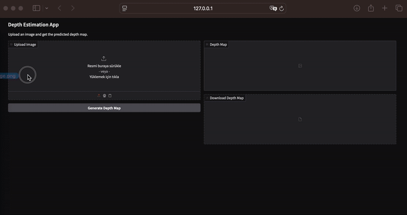

# Zoe Depth Estimation

This project utilizes the ZoeDepth model to generate depth map predictions for a given image. It includes a Gradio web interface, a FastAPI-based API, and a command-line interface (CLI).

This project is based on [this repository](https://github.com/cobanov/uctan-uca-python-egitimi-youtube) by [Mert Çobanov](https://github.com/cobanov) and was implemented for educational purposes.



## Features

- **Gradio Interface:** An interactive web demo to easily upload images and visualize their depth maps.
- **FastAPI:** A RESTful API server for performing depth estimation.
- **CLI:** A command-line tool for quick processing of single images.
- **Poetry:** Modern and reliable dependency management.
- **Docker Support:** For easily packaging and running the application in an isolated environment.
- **Jenkins Integration:** A CI/CD workflow to automate code quality checks and build processes.

## Requirements

Before you begin, ensure you have the following tools installed on your system:
- Python 3.12+
- Poetry
- Docker (if you plan to run the application with Docker)

## Installation and Setup

1.  **Clone the Repository:**
    ```bash
    git clone <your-repository-url>
    cd depth-estimation
    ```

2.  **Configure Environment Variables:**
    The project requires an `IMAGE_API_KEY` to upload the resulting depth maps. Create a file named `.env` in the project's root directory and add your API key from ImgBB.

    **`.env` file content:**
    ```
    IMAGE_API_KEY="YOUR_API_KEY_HERE"
    ```

3.  **Install Dependencies:**
    Poetry will install all project dependencies into a virtual environment.
    ```bash
    poetry install
    ```

## Usage

### 1. Local Development (with Poetry)

Use this method for development and testing the application locally.

-   **To launch the Gradio Web Interface:**
    ```bash
    poetry run python gradio_app.py
    ```
    Then, open `http://127.0.0.1:7860` in your browser.

-   **To launch the FastAPI Server:**
    ```bash
    poetry run uvicorn api:app --host 0.0.0.0 --port 8041
    ```
    The API will be accessible at `http://127.0.0.1:8041/docs`.

-   **To use the Command-Line Interface (CLI):**
    ```bash
    poetry run python cli.py <path_to_input_image> <path_to_output_image>
    ```
    **Example:**
    ```bash
    poetry run python cli.py input.jpg output.png
    ```

### 2. Running with Docker (Deployment)

Use this method to run the application in an isolated container.

1.  **Build the Docker Image:**
    ```bash
    docker build -t depth-estimation .
    ```

2.  **Run the Docker Container:**
    This command starts the FastAPI server, using the API key from your `.env` file.
    ```bash
    docker run -d -p 8041:8041 --env-file .env --name depth-api depth-estimation
    ```
    The application will now be running at `http://localhost:8041`.

## CI/CD

This project includes a `Jenkinsfile` for automation. This workflow automatically performs the following steps on each code push:
- Checks code quality with `black` and `isort`.
- Builds the project's Docker image.

## License

This project is licensed under the MIT License. See the `LICENSE` file for more details.